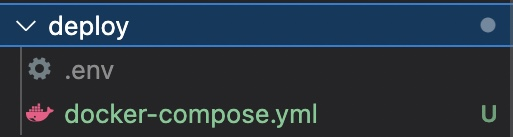

# How to execute

## Docker Compose

Configure everything in a docker-compose File, to deploy on one Host or locally and start with an empty Mongo DB.

First, customize the values for Hosts, Ports, Passwords etc. in `env.example` and rename it to .env:

```bash
.env
```

Next, you cd to the Folder containing the docker-compose.yaml:


Then run the docker-compose:

``` docker-compose up -d ```

If you want to start an additional container you can just do docker run and override the port Value to have it listen on a different Port (in this example Port 4002) like this:

``` docker run -d --env-file  ./.env -p 4002:80 se22m055/mse:latest ```

## Standalone

Similariliy, customize the .env File with e.g. the existing Mongo DB, cd to the folder and execute docker run:

``` docker run -d --env-file  ./.env se22m055/mse:latest ```

## Kubernetes

tba

## Serverless

tba
